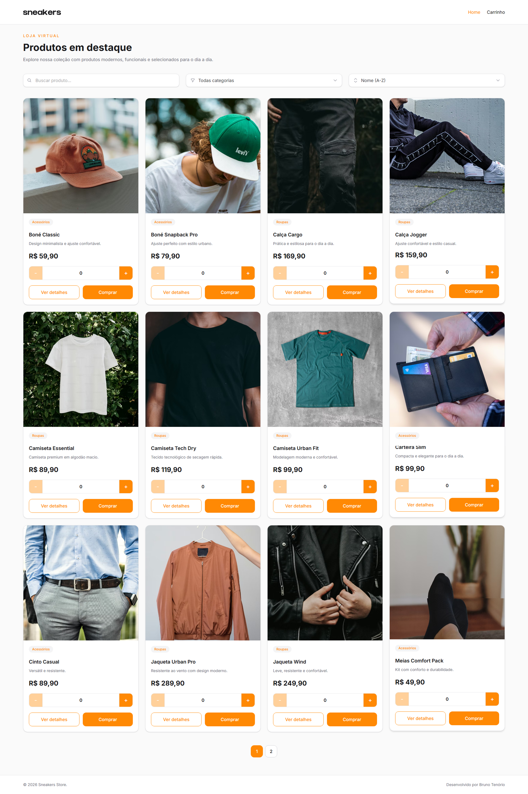

# 🛍️ React Store

Aplicação de loja virtual desenvolvida como teste técnico para vaga de **Front-end React Developer**, utilizando **React + TypeScript + Vite**.

O projeto consome dados mockados via arquivo JSON e entrega uma experiência completa de navegação em catálogo, detalhe de produto e carrinho funcional, com foco em **boas práticas**, **componentização**, **UX** e **organização de código**.

---

## Preview

### Produção

https://sneakers-store-app.vercel.app

### Preview Deploy (Pull Request)

Toda Pull Request gera automaticamente um deploy preview via Vercel para validação antes do merge.

---

## Screenshot



---

## Funcionalidades

✅ Listagem de produtos  
✅ Busca por nome  
✅ Filtro por categoria  
✅ Ordenação por nome/preço  
✅ Paginação  
✅ Página de detalhes do produto  
✅ Produtos relacionados  
✅ Carrinho funcional  
✅ Controle de quantidade  
✅ Persistência com Local Storage  
✅ Layout responsivo  
✅ SEO básico (meta tags / Open Graph / robots / sitemap)  
✅ Estados de loading / erro / vazio

---

## Stack

- React
- TypeScript
- Vite
- React Router
- Tailwind CSS
- Context API
- Local Storage

---

## Arquitetura

Estrutura baseada em separação de responsabilidades:

```bash
src/
 ├─ components/
 ├─ context/
 ├─ hooks/
 ├─ layouts/
 ├─ pages/
 ├─ routes/
 ├─ services/
 ├─ types/
 └─ utils/

public/
 ├─ data/
 └─ images/
```

Principais decisões:

- componentes reutilizáveis
- hooks customizados
- tipagem forte com TypeScript
- estado global centralizado
- persistência de carrinho
- código simples e previsível

---

## Qualidade / Fluxo de desenvolvimento

Este projeto utiliza fluxo baseado em Pull Request:

- 🚫 proibido commit direto na `main`
- ✅ merge liberado somente após Actions aprovadas
- ✅ CI automática via GitHub Actions
- ✅ Preview Deploy automático via Vercel
- ✅ link do preview comentado automaticamente no Pull Request

Arquivo de workflow:

```bash
.github/workflows/ci.front.yml
```

Objetivo:

Garantir previsibilidade antes de produção e manter qualidade mínima de entrega.

---

## Dados mockados

Durante o desenvolvimento foi utilizado JSON Server conforme proposta do desafio.

Para deploy/produção, a fonte de dados foi adaptada para JSON estático:

```bash
public/data/products.json
```

Isso mantém simplicidade, previsibilidade e elimina dependência de backend externo.

---

## Rodando localmente

Instale dependências:

```bash
npm install
```

Execute:

```bash
npm run dev
```

Acesse:

```bash
http://localhost:5173
```

---

## Considerações

Além dos requisitos obrigatórios do desafio, foram adicionadas melhorias como:

- filtros
- paginação
- persistência de carrinho
- preview deploy
- SEO básico
- organização arquitetural
- UX refinada

Buscando entregar uma solução simples, escalável e próxima de um fluxo real de desenvolvimento front-end.

---
